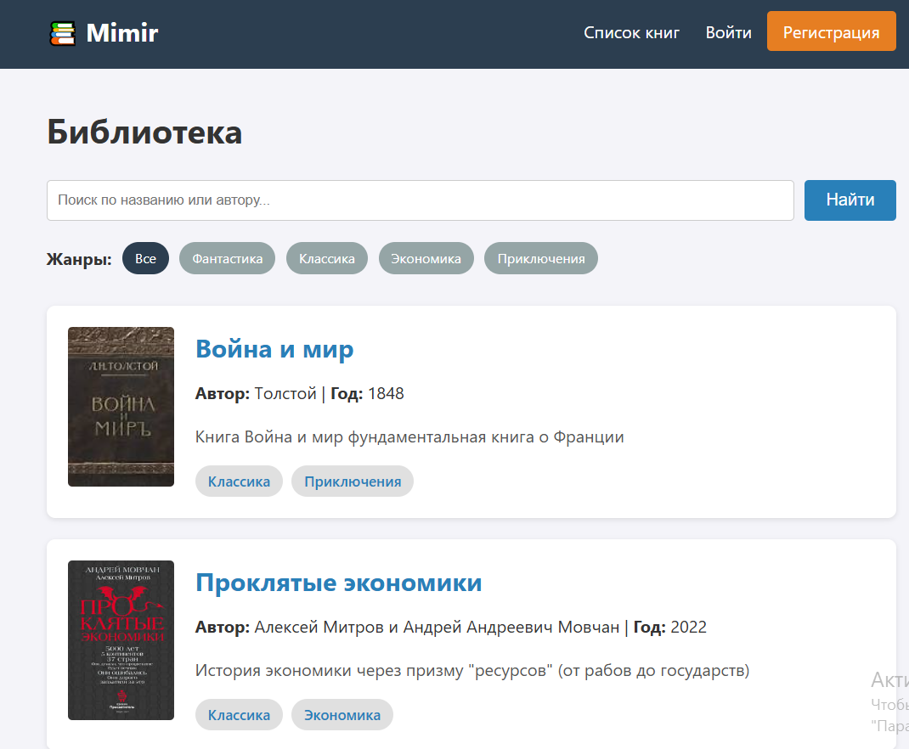
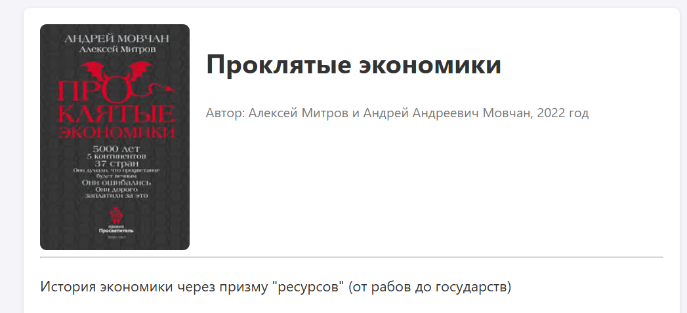
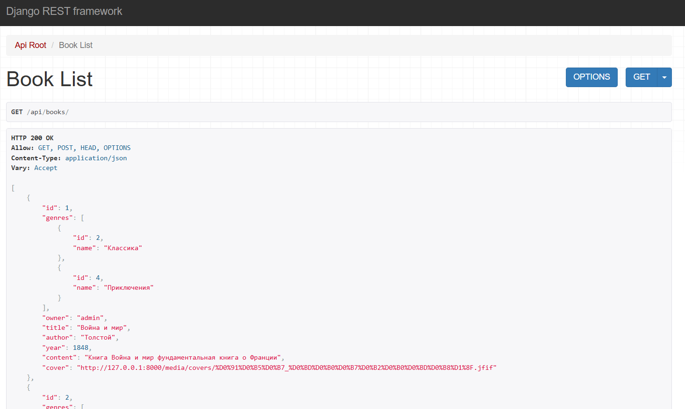

# 📚 Mimir Library


**Mimir Library** is a web application for managing a digital book collection. It allows users to browse books, search by content, filter by genres, and manage their own book records via a user-friendly interface or a REST API.

🔗 **Live Demo:** [https://normaluser.pythonanywhere.com](https://normaluser.pythonanywhere.com)

---

## 🚀 Features

*   **Authentication System:** Registration, Login, Logout using Django Auth.
*   **CRUD Operations:** Users can Create, Read, Update, and Delete books.
*   **Permissions:** 
    *   View: Available to everyone.
    *   Create/Edit/Delete: Only for authenticated users.
    *   *Object-level permission:* Users can only edit/delete their own books.
*   **Search & Filtering:**
    *   Advanced search by title, author, or content (using Q objects).
    *   Filtering by Genres (Many-to-Many relationship).
*   **Media Handling:** Upload and display book covers using Pillow.
*   **REST API:** Full API integration using Django Rest Framework (DRF) for external clients.
*   **Responsive Design:** Custom CSS styling for a clean look on desktop and mobile.

---

## 🛠 Tech Stack

*   **Core:** Python 3.10, Django 5.0
*   **API:** Django REST Framework (DRF)
*   **Database:** PostgreSQL 15
*   **Async & Tasks:** Celery + Redis
*   **Infrastructure:** Docker, Docker Compose
*   **Testing:** Django `TestCase` (Unit Tests)
*   **Frontend:** Django Templates, CSS3

---

## 🏗 Architecture

The project is fully containerized. It runs 4 services working together:
1.  **Web:** Django application (Gunicorn/Dev server).
2.  **DB:** PostgreSQL database.
3.  **Redis:** Message broker for async tasks.
4.  **Worker:** Celery worker for background processing (emails, etc).

---

## 🔜 Future Improvements (Roadmap)

*   [x] Containerization with Docker.
*   [x] Switch database to PostgreSQL.
*   [x] Async tasks with Celery.
*   [x] Unit Tests coverage.
*   [ ] CI/CD Pipeline (GitHub Actions).
*   [ ] Deploy to VPS (DigitalOcean/AWS) using Docker.

## 📸 Screenshots

### Main Page & Search


### Book Details & Genres


### API Interface


*(Note: Screenshots are placeholders. Please upload your own images to a `screenshots` folder)*

---

## 💻 Installation (Local Development)

If you want to run this project locally, follow these steps:

1.  **Clone the repository:**
    ```bash
    git clone https://github.com/shimoze/Mimir_Project.git
    cd Mimir_Project
    ```

2.  **Create and activate a virtual environment:**
    ```bash
    # Windows
    python -m venv .venv
    .venv\Scripts\activate

    # macOS/Linux
    python3 -m venv .venv
    source .venv/bin/activate
    ```

3.  **Install dependencies:**
    ```bash
    pip install -r requirements.txt
    ```

4.  **Set up environment variables:**
    Create a `.env` file in the root directory and add:
    ```env
    SECRET_KEY=your_secret_key_here
    DEBUG=True
    ```

5.  **Apply migrations:**
    ```bash
    python manage.py migrate
    ```

6.  **Create a superuser:**
    ```bash
    python manage.py createsuperuser
    ```

7.  **Run the server:**
    ```bash
    python manage.py runserver
    ```

Visit `http://127.0.0.1:8000` in your browser.

---

## 🔌 API Documentation

The project includes a browsable API provided by DRF.

*   **Base URL:** `/api/`
*   **Books Endpoint:** `/api/books/` (GET, POST)
*   **Genres Endpoint:** `/api/genres/` (GET)

Example JSON response for a book:
```json
{
    "id": 1,
    "title": "War and Peace",
    "author": "Leo Tolstoy",
    "year": 1869,
    "genres": [
        {"id": 1, "name": "Classic"},
        {"id": 2, "name": "History"}
    ],
    "owner": "admin"
}